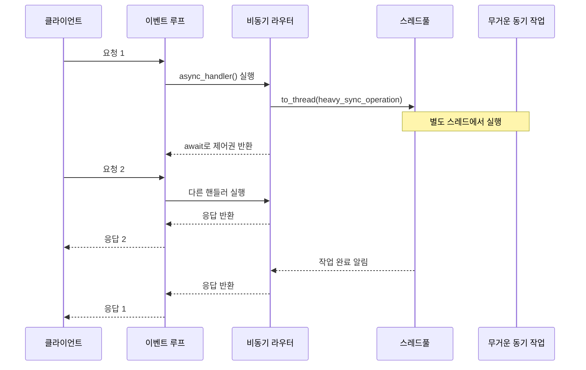

# FastAPI와 Uvicorn 이벤트 루프 분석

이 문서는 FastAPI와 Uvicorn의 이벤트 루프 동작 방식에 대한 심층 분석을 제공합니다.

## 목차
1. [Uvicorn 아키텍처 개요](#uvicorn-아키텍처-개요)
2. [이벤트 루프란?](#이벤트-루프란)
3. [FastAPI 애플리케이션 시작 과정](#fastapi-애플리케이션-시작-과정)
4. [이벤트 루프 생성 및 실행](#이벤트-루프-생성-및-실행)
5. [요청 처리 흐름](#요청-처리-흐름)
6. [비동기 라우터와 이벤트 루프 작동 방식](#비동기-라우터와-이벤트-루프-작동-방식)
7. [애플리케이션 종료 및 정리](#애플리케이션-종료-및-정리)
8. [결론 및 모범 사례](#결론-및-모범-사례)

## 1. Uvicorn 아키텍처 개요
Uvicorn은 ASGI(Asynchronous Server Gateway Interface) 서버로, FastAPI와 같은 비동기 웹 프레임워크를 실행하기 위한 인프라를 제공합니다. Uvicorn은 주로 다음 컴포넌트로 구성됩니다:

- **Server**: 메인 서버 인스턴스로 라이프사이클 관리
- **ServerState**: 여러 프로토콜 인스턴스 간 상태 공유
- **Lifespan**: 애플리케이션 시작/종료 이벤트 관리
- **Config**: 서버 구성(포트/Host등)을 관리
- **프로토콜 클래스**: HTTP/1.1/WebSocket 프로토콜 구현


Uvicorn은 클라이언트와 FastAPI 사이의 중요한 브릿지 역할을 수행합니다. 클라이언트의 Raw HTTP 요청을 수신하여 ASGI 호환 딕셔너리로 변환한 후 FastAPI에 전달합니다. 

이 과정에서 HTTP 파싱과 ASGI 형식 변환이 이루어지며, 비동기 처리를 통해 높은 동시성을 제공합니다. Uvicorn과 FastAPI의 조합은 Python 생태계에서 가장 효율적인 웹 서버 구성 중 하나입니다.

## 2. 이벤트 루프란?

이벤트 루프는 비동기 프로그래밍의 핵심 요소로, 여러 작업을 동시에 처리할 수 있게 해주는 실행 메커니즘입니다. Python에서는 `asyncio` 모듈이 이벤트 루프를 제공합니다.

이벤트 루프는:
- 비동기 작업(코루틴)을 예약하고 실행
- I/O 작업 관리
- 타이머 및 콜백 실행
- 효율적인 멀티태스킹 처리

## 이벤트 루프 동작 원리

### OS와의 상호작용


*이미지 출처: [출처](https://www.pythontutorial.net/python-concurrency/python-event-loop/)

위 다이어그램은 Python 이벤트 루프와 OS의 상호작용을 보여줍니다:

1. **메인 스레드**에서 태스크가 이벤트 루프의 **태스크 큐**에 제출됩니다.
2. 이벤트 루프는 태스크 큐를 모니터링하고 태스크를 하나씩 실행합니다.
3. 태스크가 I/O 작업으로 블로킹될 때, 이벤트 루프는 해당 태스크를 일시 중지하고 OS에 I/O 처리를 위임합니다.
4. 이벤트 루프는 계속해서 다른 태스크를 실행합니다.
5. OS가 I/O 작업 완료를 알리면, 이벤트 루프는 중지된 태스크를 재개합니다.

이러한 논블로킹 I/O 모델은 FastAPI와 같은 비동기 웹 프레임워크가 단일 스레드에서도 높은 동시성을 달성할 수 있게 합니다. 이벤트 루프는 I/O 작업이 OS에 의해 백그라운드에서 처리되는 동안 CPU 리소스를 효율적으로 활용하여 다른 태스크를 실행합니다.

### 이벤트루프 스레드풀 동작 메커니즘


*이미지출처: [출처](https://velog.io/@young18/JS-NodeJS%EC%9D%98-%EC%95%84%ED%82%A4%ED%85%8D%EC%B2%98)

이 다이어그램은 이벤트 루프가 애플리케이션과 스레드 풀 사이에서 어떻게 작업을 조율하는지 보여줍니다:

1. **애플리케이션**에서 여러 태스크가 **이벤트 루프**에 제출됩니다.
2. 이벤트 루프는 **단일 스레드**에서 실행되며, 논블로킹 작업은 직접 처리합니다.
3. 블로킹 작업(CPU 집약적인 작업이나 동기식 I/O)은 별도의 **워커 스레드**로 오프로드됩니다.
4. 작업이 완료되면 이벤트 루프에 통지되고, 등록된 **콜백**이 실행됩니다.
5. 콜백 처리가 완료되면 결과가 애플리케이션에 반환됩니다.

이 모델은 FastAPI와 같은 프레임워크에서 중요한데, 특히 `asyncio.to_thread()`와 같은 기능을 사용하여 무거운 작업을 별도 스레드로 오프로드할 때 이 패턴을 따릅니다. 


## 3. FastAPI 애플리케이션 시작 과정

FastAPI 애플리케이션을 실행할 때, 다음과 같은 흐름으로 진행됩니다:

1. `uvicorn.run(app, ...)` 호출
2. `Config` 객체 생성 및 설정
3. `Server` 객체 생성
4. `server.run()` 호출
5. 이벤트 루프 설정 및 실행
6. 애플리케이션 시작 이벤트 처리

코드 분석을 통해 확인할 수 있듯이, `uvicorn.main.py`의 `run()` 함수는 서버 실행의 진입점입니다:

```python
def run(app, *, host="127.0.0.1", port=8000, ...):
    config = Config(app, host=host, port=port, ...)
    server = Server(config=config)
    
    # ... 생략 ...
    
    server.run()
```

## 이벤트 루프 생성 및 실행

Uvicorn에서 이벤트 루프가 생성되고 실행되는 과정은 `Server.run()` 메서드에서 시작됩니다:

```python
def run(self, sockets=None):
    self.config.setup_event_loop()
    return asyncio.run(self.serve(sockets=sockets))
```

이 메서드는:
1. `setup_event_loop()`를 통해 이벤트 루프 정책 설정
2. `asyncio.run()`으로 비동기 서버 시작
3. `self.serve()` 메서드에서 실제 서버 로직 실행

이벤트 루프가 설정되면, `Server._serve()` 메서드에서 다음 단계로 진행됩니다:

```python
async def _serve(self, sockets=None):
    # ... 생략 ...
    await self.startup(sockets=sockets)
    if self.should_exit:
        return
    await self.main_loop()
    await self.shutdown(sockets=sockets)
    # ... 생략 ...
```

## 요청 처리 흐름

HTTP 요청이 도착하면 다음과 같은 처리 흐름을 따릅니다:

1. 소켓 리스너가 연결 수락
2. HTTP 프로토콜 인스턴스 생성
3. 요청 데이터를 ASGI 이벤트로 변환
4. FastAPI 라우터로 요청 전달
5. 해당 경로의 비동기 핸들러 실행
6. 응답 생성 및 반환

전체 과정은 이벤트 루프에서 비동기적으로 처리됩니다. 따라서 I/O 작업이 발생하면 다른 요청을 처리할 수 있어 서버의 처리량이 향상됩니다.

## 비동기 라우터와 이벤트 루프 작동 방식

FastAPI에서 비동기 라우터가 작동하는 방식은 다음과 같습니다:

```python
@app.get("/async-task")
async def async_task():
    # 비동기 작업 수행
    await asyncio.sleep(2)
    # 현재 실행 중인 이벤트 루프 정보
    current_loop = asyncio.get_running_loop()
    return {"message": "완료"}
```

Python에서 `async def`로 정의된 함수는 **코루틴(coroutine)** 객체를 반환합니다. 코루틴은 중간에 실행을 일시 중지하고 나중에 다시 재개할 수 있는 특별한 함수입니다. 이 특성이 이벤트 루프 기반의, 논블로킹 비동기 실행의 핵심입니다.

비동기 라우터(코루틴)가 호출되면:
1. 이벤트 루프에 코루틴 등록
2. `await` 지점에서 제어권을 이벤트 루프에 반환(일시 중지)
3. 다른 작업 실행 가능
4. `await` 완료 후 코루틴 계속 실행(재개)
5. 응답 반환

이 과정은 앞서 설명한 이벤트 루프의 일반적인 작동 원리를 따릅니다. FastAPI 라우터 함수에서 `await`를 사용하면 I/O 작업이 필요할 때 제어권을 이벤트 루프에 반환하여 다른 요청을 처리할 수 있게 합니다. 이러한 방식으로 단일 프로세스에서도 수천 개의 동시 연결을 효율적으로 처리할 수 있습니다.

### ❌ 이벤트 루프 블로킹 안티패턴
> ⚠️ 비동기 메서드 안에서, 속도가 오래걸리는 동기(Sync)메서드는 사용하면 심각한 병목이 발생됨.


비동기 라우터 내에서 무거운 동기 작업을 직접 호출하는 것은 심각한 안티패턴입니다. 다음 예시를 살펴보세요:

```python
@app.get("/bad-practice")
async def process_data():
    # 위험! 이벤트 루프 블로킹
    result = heavy_cpu_bound_operation()  # 동기 함수 - 이벤트 루프 차단
    return {"result": result}
```

이 코드의 문제점:
- `heavy_cpu_bound_operation()`은 동기 함수로, 이벤트 루프를 차단합니다.
- 이 작업이 실행되는 동안 **모든 다른 요청 처리가 중지**됩니다.
- 서버 전체의 응답성이 크게 저하됩니다.

### ✅ 올바른 패턴: 무거운 작업 오프로딩



올바른 접근 방식은 CPU 바운드 작업을 별도의 스레드나 프로세스로 오프로드하는 것입니다:

```python
@app.get("/good-practice")
async def process_data():
    # 올바른 방법! 무거운 작업을 스레드풀로 오프로드
    result = await asyncio.to_thread(heavy_cpu_bound_operation)
    return {"result": result}
```

이 방식의 이점:
- 이벤트 루프가 차단되지 않습니다.
- 다른 요청을 계속 처리할 수 있습니다.
- 서버 전체의 응답성이 유지됩니다.


## 애플리케이션 종료 및 정리

애플리케이션 종료 시 다음 단계가 수행됩니다:

1. `Server.shutdown()` 메서드 호출
2. 새 연결 수락 중지
3. 기존 연결에 종료 요청
4. 실행 중인 작업 완료 대기
5. Lifespan 종료 이벤트 발생
6. 리소스 정리

종료 과정은 `capture_signals()` 컨텍스트 관리자를 통해 SIGINT, SIGTERM 등의 신호를 캡처하여 시작됩니다.

## 결론 및 모범 사례

FastAPI와 Uvicorn의 이벤트 루프 기반 아키텍처는 효율적인 비동기 웹 애플리케이션 개발을 위한 강력한 기반을 제공합니다. 최적의 성능을 위한 몇 가지 모범 사례:

1. **I/O 바운드 작업에 `async`/`await` 사용**: 네트워크 요청, 데이터베이스 쿼리 등
2. **CPU 바운드 작업은 스레드풀로 오프로드**: `asyncio.to_thread()` 사용
3. **이벤트 루프 블로킹 방지**: 긴 계산 작업은 분리
4. **비동기 클라이언트 라이브러리 사용**: `httpx`, `asyncpg`, `motor` 등
5. **적절한 worker수 설정**: 코어당 1-2개 정도 권장

### 개발자를 위한 팁

- 디버깅 목적으로 `PYTHONASYNCIODEBUG=1` 환경 변수를 사용하면 이벤트 루프 내부 동작을 더 자세히 관찰할 수 있습니다.
- 코루틴이 완료되지 않는 경우, 이벤트 루프가 닫히지 않아 애플리케이션이 정상적으로 종료되지 않을 수 있습니다.
- 데이터베이스 연결이나 HTTP 클라이언트는 애플리케이션 수명 주기 동안 재사용하는 것이 좋습니다.

이벤트 루프의 작동 방식을 이해하면 효율적인 FastAPI 애플리케이션을 설계하고 최적화하는 데 도움이 됩니다.


### 참고문서
- https://www.pythontutorial.net/python-concurrency/python-event-loop/
- https://docs.python.org/3/library/asyncio-eventloop.html