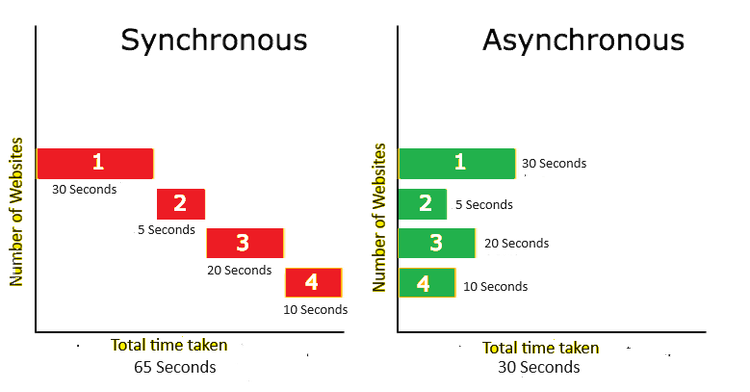
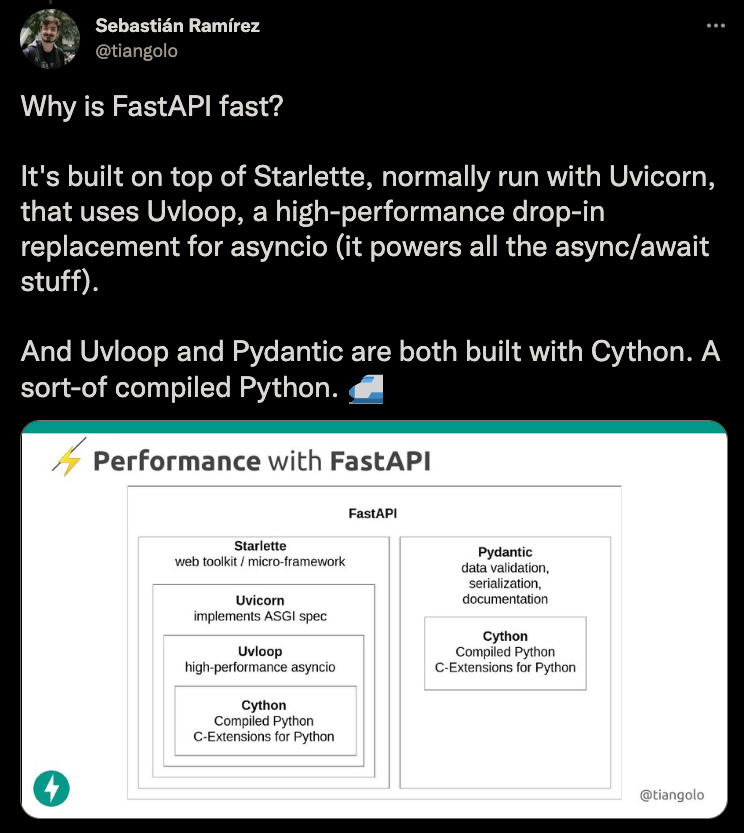
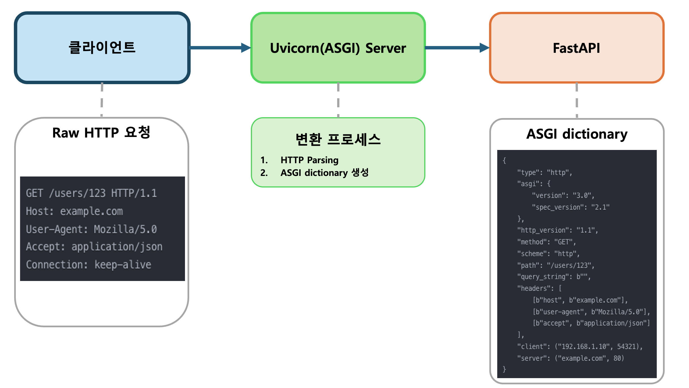
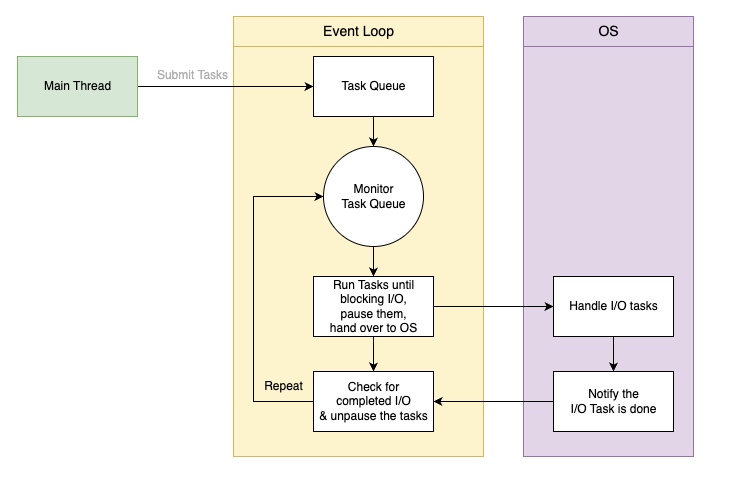
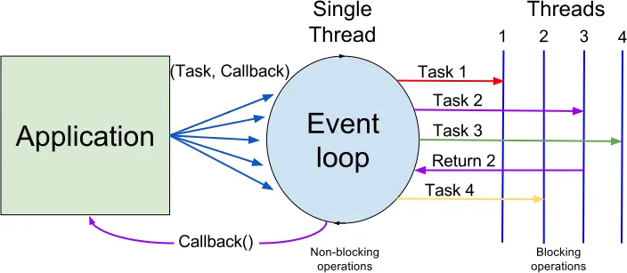
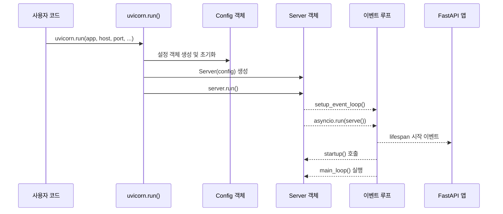
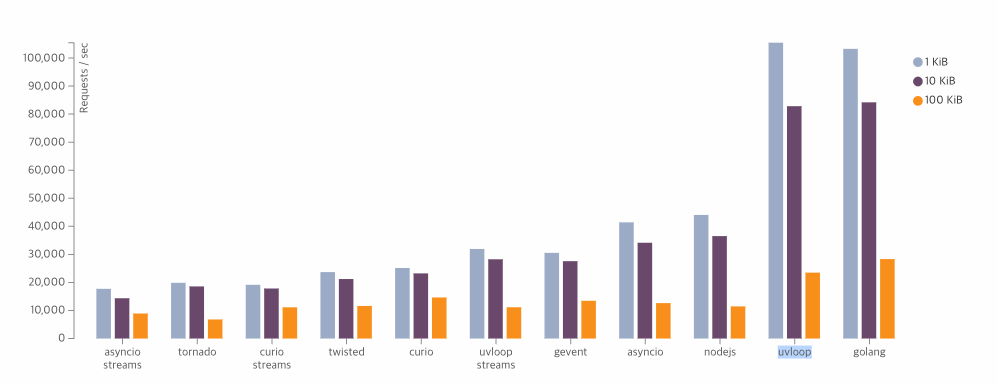
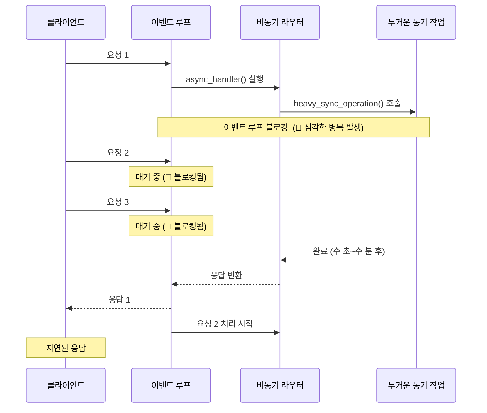

## 목차
0. [동기 프로그래밍의 제약과 비동기의 필요성](#동기-프로그래밍의-제약과-비동기의-필요성)
1. [FastAPI는 왜 빠른가?](#fastapi는-왜-빠른가)
2. [Uvicorn 아키텍처 개요](#uvicorn-아키텍처-개요)
3. [이벤트 루프란?](#이벤트-루프란)
4. [FastAPI 애플리케이션 시작 과정](#fastapi-애플리케이션-시작-과정)
5. [이벤트 루프 생성 및 실행](#이벤트-루프-생성-및-실행)
6. [요청 처리 흐름](#요청-처리-흐름)
7. [비동기 라우터와 이벤트 루프 작동 방식](#비동기-라우터와-이벤트-루프-작동-방식)
8. [비동기 안티패턴](#비동기-안티패턴)
9. [애플리케이션 종료 및 정리](#애플리케이션-종료-및-정리)
10. [결론 및 모범 사례](#결론-및-모범-사례)

## 들어가기에 앞서(용어정리)

### 동기(Synchronous)
- 순차적인 실행 흐름을 지키는 방식입니다.
- 한 작업이 완료될 때까지 다음 작업이 대기하는 블로킹 방식으로 동작합니다.
- I/O 작업 중에는 CPU가 아무 일도 하지 않고 대기하게 되어 시스템 자원이 낭비됩니다.
- 동시에 여러 요청을 처리할 때 병목 현상이 발생합니다.

### 비동기(Asynchronous)
- 이전 작업이 완료되지 않았더라도 다음 작업을 수행할 수 있는 논블로킹 방식입니다.
- 동시성(Concurrency): 여러 작업을 번갈아가며 처리하는 것으로, 병렬 실행이 아닌 작업 전환을 의미합니다.
- I/O 작업은 OS에 위임하고, 그 동안 CPU는 다른 작업을 처리하여 시스템 자원을 효율적으로 활용합니다.
- Python에서는 `async`/`await` 구문을 통해 구현합니다.

### 멀티태스킹의 두 가지 방식
##### 선점형 멀티태스킹(Preemptive multitasking)
OS가 작업에 시간 할당 후 강제로 전환. `멀티스레딩`과 `멀티프로세싱`이 이 방식을 사용하며, Python에서는 멀티프로세싱을 통해 진정한 병렬 처리가 가능합니다.

##### 협력적 멀티태스킹(Cooperative multitasking)
작업이 스스로 제어권을 양보할 때만 전환됩니다. Python의 비동기 프로그래밍(`async/await`)이 이 방식으로 동작하며 **I/O 작업에서 특히 효율적**입니다.

## 0. 동기 프로그래밍의 제약과 비동기의 필요성

### Python의 GIL(Global Interpreter Lock)

Python에는 GIL이라는 근본적인 제약이 있습니다. GIL은 한 프로세스 내에서 한 번에 하나의 스레드만 Python 코드를 실행할 수 있도록 제한하는 메커니즘입니다. 이로 인해 멀티코어 CPU를 가진 현대 시스템에서도 멀티스레딩을 사용하더라도 CPU 바운드 작업에서는 병렬 실행이 제한됩니다.

> **Python의 GIL 개선 노력**: 최신 Python 개발에서는 GIL의 제약을 완화하거나 제거하는 방향으로 발전하고 있습니다. Python 3.12에서는 '하위 인터프리터(Subinterpreters)'를 도입하여 각 인터프리터가 독립적인 GIL을 가지도록 함으로써 병렬 처리 능력을 개선했습니다. 또한 PEP 703에서는 향후 Python의 'GIL-less' 실행 모드에 대한 계획을 제시하고 있으며, 이는 Python의 병렬 처리 능력을 크게 향상시킬 것으로 기대됩니다.


### 동기 vs 비동기: OS 자원 활용 관점에서

동기와 비동기 처리 방식의 핵심적인 차이는 OS 자원 활용도에 있습니다:


#### 동기 처리 방식
- 작업이 순차적으로 실행됩니다(1→2→3→4).
- **단일 스레드에서의 요청 직렬화**: 
  - 단일 스레드 동기 방식에서는 하나의 요청이 완료될 때까지 다른 요청을 처리할 수 없습니다.
  - 예를 들어, 5초가 걸리는 API 요청 2건을 단일 스레드 동기 서버에 보내면, 첫 번째 요청이 완료된 후에야 두 번째 요청 처리가 시작되어 총 10초가 소요됩니다.
- **주목할 점**: 동기 방식에서는 I/O 작업 중에도 CPU가 대기 상태에 있어 시스템 자원이 낭비됩니다.
- 총 처리 시간은 모든 작업 시간의 합(예: 30초+5초+20초+10초=65초)입니다.
- Python은 멀티스레딩을 지원하지만, GIL로 인해 CPU 바운드 작업에서는 여전히 제약이 있습니다. I/O 바운드 작업에서는 멀티스레딩이 여전히 효과적일 수 있습니다.

#### 비동기 처리 방식
- 작업이 동시에(concurrent) 실행되지만, 진정한 병렬(parallel) 실행이 아닌 작업 간 전환을 의미합니다.
- I/O 작업은 OS에 위임되고, 그 동안 CPU는 다른 작업을 처리합니다.
    - ➔ 이로 인해, I/O 처리 능력 실질적인 한계는 OS 자체의 리소스 제한에 의해 결정됩니다.
- 비동기는 I/O 작업에서 대기 시간을 줄여 전체 처리량을 높이는 데 효과적입니다.
- 총 처리 시간은 가장 긴 작업의 시간(예: 30초)에 가깝지만, 이벤트 루프 오버헤드와 작업 간 전환 비용도 고려해야 합니다.
- **이벤트 루프 기반 동시성**:
  - 단일 스레드에서 여러 작업을 인터리빙(interleaving)하여 실행
  - I/O 작업 중에는 제어권을 다른 작업에 넘겨 CPU 활용도 극대화

### 동기 프로그래밍의 근본적 한계

전통적인 동기(Synchronous) 웹 서버에서는 다음과 같은 문제가 발생합니다:

1. **I/O 작업의 비효율성**:
   - 데이터베이스 쿼리, 네트워크 요청, 파일 읽기/쓰기와 같은 I/O 작업은 대부분의 시간을 대기 상태로 보냅니다.
   - 동기 방식에서는 이러한 대기 시간 동안 서버가 다른 작업을 수행할 수 없습니다.

2. **확장성 문제**:
   - 동시 요청을 처리하기 위해 멀티스레딩을 사용해도 GIL로 인해 CPU 바운드 작업에서는 실질적인 병렬 처리가 제한됩니다.
   - 스레드 생성과 컨텍스트 스위칭에 상당한 오버헤드가 발생합니다.

### 비동기 프로그래밍의 장점

이러한 제약을 극복하기 위해 비동기(Asynchronous) 프로그래밍 모델이 주목받게 되었습니다:

1. **I/O 작업의 최적화**:
   - I/O 작업이 OS에 위임되는 동안 GIL이 해제되어, 그 동안 다른 Python 코드 실행이 가능합니다.
   - 대기 시간을 효율적으로 활용하여 처리량이 증가합니다.

2. **뛰어난 확장성**:
   - 작은 수의 스레드로 수천 개의 동시 연결 처리가 가능합니다.
   - 메모리 사용량과 컨텍스트 스위칭 오버헤드가 최소화됩니다.

3. **코루틴(Coroutine)을 통한 효율적인 제어 흐름**:
   - Python의 `async`/`await` 구문을 사용하여 비동기 코드를 동기 코드처럼 작성할 수 있습니다.
   - 코루틴은 실행을 일시 중지하고 나중에 재개할 수 있는 특별한 함수로, 비동기 프로그래밍의 핵심입니다.

### 비동기와 동기의 적절한 사용 영역

비동기 프로그래밍은 만능 해결책이 아니며, 작업 유형과 상황에 따라 적절한 접근 방식을 선택해야 합니다:

> **동기 프로그래밍이 더 효과적인 영역**:
> - **기계 학습 및 AI 모델 학습**: 데이터 처리와 모델 훈련 과정은 CPU 계산 집약적이며 순차적 처리가 필요한 경우가 많습니다.
> - **데이터 분석 파이프라인**: 대규모 데이터셋 처리 시 동기식 멀티프로세싱이 더 효율적일 수 있습니다.
> - **단순한 스크립트**: 오버헤드가 적고 실행 흐름이 명확합니다.

**적절한 프로그래밍 모델 선택**:
- **I/O 바운드 작업**: 비동기 프로그래밍이 매우 효과적
- **CPU 바운드 작업**: 멀티프로세싱이 더 효율적


이러한 배경에서 FastAPI와 같은 비동기 웹 프레임워크가 각광받게 되었으며, 특히 FastAPI는 그 핵심에 이벤트 루프 기반 아키텍처를 활용하여 웹 서비스에서 뛰어난 성능을 발휘합니다.

## 1. FastAPI는 왜 빠른가?


* 출처: FastAPI의 개발자 [Sebastián Ramírez](https://x.com/tiangolo/status/1336707150559784962)

FastAPI가 빠른 이유는 다음과 같은 기술 스택의 계층적 구조 덕분입니다:

1. **FastAPI**는 **Starlette**을 기반으로 합니다
   - Starlette은 빠른 웹 툴킷/마이크로 프레임워크입니다

2. **Starlette**은 **Uvicorn**으로 실행됩니다
   - Uvicorn은 ASGI 스펙을 구현한 서버입니다

3. **Uvicorn**은 **Uvloop**을 사용합니다
   - Uvloop은 Python의 asyncio를 대체하는 고성능 비동기 라이브러리입니다
   - Uvloop은 Node.js의 비동기 I/O 핵심인 **libuv**를 기반으로 만들어졌습니다

4. **Uvloop**과 **Pydantic**(FastAPI의 데이터 검증 라이브러리)은 모두 **Cython**으로 작성되었습니다
   - Cython은 Python 코드를 C로 컴파일하여 성능을 크게 향상시키는 기술입니다

이러한 계층적 구조와 비동기 처리 방식을 통해 FastAPI는 Python의 GIL 제약을 효과적으로 우회하며 뛰어난 성능을 발휘합니다.

## 1. Uvicorn 아키텍처 개요
Uvicorn은 ASGI(Asynchronous Server Gateway Interface) 서버로, FastAPI와 같은 비동기 웹 프레임워크를 실행하기 위한 인프라를 제공합니다. Uvicorn은 주로 다음 컴포넌트로 구성됩니다:

- **Server**: 메인 서버 인스턴스로 라이프사이클 관리
- **ServerState**: 여러 프로토콜 인스턴스 간 상태 공유
- **Lifespan**: 애플리케이션 시작/종료 이벤트 관리
- **Config**: 서버 구성(포트/Host등)을 관리
- **프로토콜 클래스**: HTTP/1.1/WebSocket 프로토콜 구현



Uvicorn은 클라이언트와 FastAPI 사이의 중요한 브릿지 역할을 수행합니다. 클라이언트의 Raw HTTP 요청을 수신하여 ASGI 호환 딕셔너리로 변환한 후 FastAPI에 전달합니다. 

이 과정에서 HTTP 파싱과 ASGI 형식 변환이 이루어지며, 비동기 처리를 통해 높은 동시성을 제공합니다. Uvicorn과 FastAPI의 조합은 Python 생태계에서 가장 효율적인 웹 서버 구성 중 하나입니다.

## 2. 이벤트 루프란?

이벤트 루프는 비동기 프로그래밍의 핵심 요소로, 여러 작업을 동시에 처리할 수 있게 해주는 실행 메커니즘입니다. Python에서는 `asyncio` 모듈이 이벤트 루프를 제공합니다.

이벤트 루프는:
- 비동기 작업(코루틴)을 예약하고 실행
- I/O 작업 관리
- 타이머 및 콜백 실행
- 효율적인 멀티태스킹 처리

## 이벤트 루프 동작 원리

### OS와의 상호작용



*이미지 출처: [출처](https://www.pythontutorial.net/python-concurrency/python-event-loop/)

위 다이어그램은 Python 이벤트 루프와 OS의 상호작용을 보여줍니다:

1. **메인 스레드**에서 태스크가 이벤트 루프의 **태스크 큐**에 제출됩니다.
2. 이벤트 루프는 태스크 큐를 모니터링하고 태스크를 하나씩 실행합니다.
3. 태스크가 I/O 작업으로 블로킹될 때, 이벤트 루프는 해당 태스크를 일시 중지하고 OS에 I/O 처리를 위임합니다.
4. 이벤트 루프는 계속해서 다른 태스크를 실행합니다.
5. OS가 I/O 작업 완료를 알리면, 이벤트 루프는 중지된 태스크를 재개합니다.

이러한 논블로킹 I/O 모델은 FastAPI와 같은 비동기 웹 프레임워크가 단일 스레드에서도 높은 동시성을 달성할 수 있게 합니다. 이벤트 루프는 I/O 작업이 OS에 의해 백그라운드에서 처리되는 동안 CPU 리소스를 효율적으로 활용하여 다른 태스크를 실행합니다.

### 이벤트루프 스레드풀 동작 메커니즘



*이미지출처: [출처](https://velog.io/@young18/JS-NodeJS%EC%9D%98-%EC%95%84%ED%82%A4%ED%85%8D%EC%B2%98)

이 다이어그램은 이벤트 루프가 애플리케이션과 스레드 풀 사이에서 어떻게 작업을 조율하는지 보여줍니다:

1. **애플리케이션**에서 여러 태스크가 **이벤트 루프**에 제출됩니다.
2. 이벤트 루프는 **단일 스레드**에서 실행되며, 논블로킹 작업은 직접 처리합니다.
3. 블로킹 작업(CPU 집약적인 작업이나 동기식 I/O)은 별도의 **워커 스레드**로 오프로드됩니다.
4. 작업이 완료되면 이벤트 루프에 통지되고, 등록된 **콜백**이 실행됩니다.
5. 콜백 처리가 완료되면 결과가 애플리케이션에 반환됩니다.

이 모델은 FastAPI와 같은 프레임워크에서 중요한데, 특히 `asyncio.to_thread()`와 같은 기능을 사용하여 무거운 작업을 별도 스레드로 오프로드할 때 이 패턴을 따릅니다. 

## 3. FastAPI 애플리케이션 시작 과정

FastAPI 애플리케이션의 시작 과정은 다음과 같은 핵심 단계로 요약할 수 있습니다:



### 시작 과정의 핵심 코드

```python
# .venv/lib/python3.11/site-packages/uvicorn/main.py
def run(app, host="127.0.0.1", port=8000, ...):
    config = Config(app, host=host, port=port, ...)
    server = Server(config=config)
    server.run()

# .venv/lib/python3.11/site-packages/uvicorn/server.py
class Server:
    def run(self, sockets=None):
        self.config.setup_event_loop()
        return asyncio.run(self.serve(sockets=sockets))
```
아래에서는 `self.config.setup_event_loop()` 메서드에 대해 더 깊게 살펴볼 예정입니다.

이 과정을 통해 FastAPI 애플리케이션을 실행하기 위한 기반이 마련됩니다.

## 4. 이벤트 루프 생성 및 실행

Uvicorn에서 이벤트 루프의 생성과 실행은 서버의 핵심 작동 원리입니다. 이 과정을 자세히 살펴보겠습니다.

### 4.1 이벤트 루프 설정

```python
# .venv/lib/python3.11/site-packages/uvicorn/config.py

LOOP_SETUPS: dict[LoopSetupType, str | None] = {
    "none": None,
    "auto": "uvicorn.loops.auto:auto_loop_setup",
    "asyncio": "uvicorn.loops.asyncio:asyncio_setup",
    "uvloop": "uvicorn.loops.uvloop:uvloop_setup",
}
class Config:
    ...
    self.loop = 

    def setup_event_loop(self) -> None:
        loop_setup: Callable | None = import_from_string(LOOP_SETUPS[self.loop])
        if loop_setup is not None:
            loop_setup(use_subprocess=self.use_subprocess)
```

이 코드는 Uvicorn 서버가 사용할 `이벤트 루프 정책`을 설정합니다. 주요 옵션은:

- **auto**: 기본값
- **uvloop**: 더 빠른 C 기반 이벤트 루프 구현
- **asyncio**: Python 표준 라이브러리의 기본 이벤트 루프

```python
# .venv/lib/python3.11/site-packages/uvicorn/loops/auto.py
def auto_loop_setup(use_subprocess: bool = False) -> None:
    try:
        import uvloop  # noqa
    except ImportError:  # pragma: no cover
        from uvicorn.loops.asyncio import asyncio_setup as loop_setup

        loop_setup(use_subprocess=use_subprocess)
    else:  # pragma: no cover
        from uvicorn.loops.uvloop import uvloop_setup

        uvloop_setup(use_subprocess=use_subprocess)
```
> 확인해보니, 특정 버전 이후로는 uvicorn설치하면 uvloop가 자동으로 설치되는듯?

[uvloop Github](https://github.com/MagicStack/uvloop), [uvloop 공식문서](https://magic.io/blog/uvloop-blazing-fast-python-networking/)에서 확인할 수 있듯이, asyncio보다 빠르다고 강조한다.


### 4.2 이벤트 루프 생성 및 실행

```python
# .venv/lib/python3.11/site-packages/uvicorn/server.py
def run(self, sockets=None):
    self.config.setup_event_loop()
    return asyncio.run(self.serve(sockets=sockets))
```

**앞서 설정된 이벤트 루프 정책(예: uvloop)에 따라 `asyncio.run()이 새로운 이벤트 루프를 생성합니다.**

`asyncio.run()`은 다음과 같은 작업을 수행합니다:

1. 새로운 이벤트 루프 생성
2. 루프 내에서 코루틴(`self.serve()`) 실행
3. 코루틴 완료 후 이벤트 루프 종료 및 정리

이는 FastAPI 애플리케이션의 전체 생명주기를 관리하는 최상위 이벤트 루프입니다.

### 4.3 이벤트 루프 동작 분석

서버가 시작되면 이벤트 루프는 다음과 같은 단계로 작동합니다:

```python
# .venv/lib/python3.11/site-packages/uvicorn/server.py
async def serve(self, sockets=None):
    with self.capture_signals():
        await self._serve(sockets)

async def _serve(self, sockets=None):
    # 설정 로드 및 lifespan 관리자 생성
    config = self.config
    if not config.loaded:
        config.load()
    self.lifespan = config.lifespan_class(config)
    
    # 애플리케이션 시작
    await self.startup(sockets=sockets)
    if self.should_exit:
        return
    
    # 메인 이벤트 루프 실행
    await self.main_loop()
    
    # 서버 종료
    await self.shutdown(sockets=sockets)
```

이벤트 루프 실행 과정에서 중요한 단계는:

1. **애플리케이션 시작 이벤트 발생**: `await self.lifespan.startup()`을 통해 ASGI 애플리케이션에 startup 이벤트를 전송하고, FastAPI의 `@app.on_event("startup")` 데코레이터로 등록된 함수들이 실행됩니다.

2. **HTTP 서버 소켓 설정**: 이벤트 루프에 HTTP 서버 소켓을 등록합니다.
   ```python
   servers = []
   for sock in sockets:
       server = await loop.create_server(
           create_protocol, sock=sock, ssl=ssl, backlog=backlog
       )
       servers.append(server)
   ```

3. **메인 루프 실행**: 서버가 실행되는 동안 주기적인 유지 관리 작업을 수행합니다.
   ```python
   async def main_loop(self):
       counter = 0
       should_exit = await self.on_tick(counter)
       while not should_exit:
           counter += 1
           counter = counter % 864000
           await asyncio.sleep(0.1)
           should_exit = await self.on_tick(counter)
   ```

### 4.4 이벤트 루프와 요청 처리 메커니즘

이벤트 루프가 생성된 후, 클라이언트 요청이 도착하면 다음과 같은 처리가 이루어집니다:

1. **소켓 연결 수락**: 이벤트 루프는 클라이언트 연결을 비동기적으로 수락합니다.

2. **프로토콜 인스턴스 생성**: 각 연결에 대해 HTTP 프로토콜 인스턴스가 생성됩니다.
   ```python
   def create_protocol(_loop=None):
       return config.http_protocol_class(
           config=config,
           server_state=self.server_state,
           app_state=self.lifespan.state,
           _loop=_loop,
       )
   ```

3. **요청 데이터 수신 및 파싱**: HTTP 프로토콜 인스턴스는 요청 데이터를 수신하고 파싱합니다.

4. **ASGI 이벤트 전달**: 파싱된 요청은 ASGI 호환 이벤트로 변환되어 FastAPI 애플리케이션에 전달됩니다.

5. **라우터 실행**: FastAPI는 해당 경로에 매핑된 비동기 핸들러를 실행합니다.

6. **응답 생성 및 반환**: 핸들러의 반환값은 HTTP 응답으로 변환되어 클라이언트에 전송됩니다.

이 모든 과정은 이벤트 루프 내에서 비동기적으로 처리되며, I/O 작업이 발생할 때마다 이벤트 루프는 다른 작업을 처리할 수 있어 서버의 처리량이 크게 향상됩니다.

## 5. 요청 처리 흐름

HTTP 요청이 도착하면 다음과 같은 처리 흐름을 따릅니다:

1. 소켓 리스너가 연결 수락
2. HTTP 프로토콜 인스턴스 생성
3. 요청 데이터를 ASGI 이벤트로 변환
4. FastAPI 라우터로 요청 전달
5. 해당 경로의 비동기 핸들러 실행
6. 응답 생성 및 반환

전체 과정은 이벤트 루프에서 비동기적으로 처리됩니다. 따라서 I/O 작업이 발생하면 다른 요청을 처리할 수 있어 서버의 처리량이 향상됩니다.

## 6. 비동기 라우터와 이벤트 루프 작동 방식

FastAPI에서 비동기 라우터가 작동하는 방식은 다음과 같습니다:

```python
@app.get("/async-task")
async def async_task():
    # 비동기 작업 수행
    await asyncio.sleep(2)
    # 현재 실행 중인 이벤트 루프 정보
    current_loop = asyncio.get_running_loop()
    return {"message": "완료"}
```

Python에서 `async def`로 정의된 함수는 **코루틴(coroutine)** 객체를 반환합니다. 코루틴은 중간에 실행을 일시 중지하고 나중에 다시 재개할 수 있는 특별한 함수입니다. 이 특성이 이벤트 루프 기반의, 논블로킹 비동기 실행의 핵심입니다.

비동기 라우터(코루틴)가 호출되면:
1. 이벤트 루프에 코루틴 등록
2. `await` 지점에서 제어권을 이벤트 루프에 반환(일시 중지)
3. 다른 작업 실행 가능
4. `await` 완료 후 코루틴 계속 실행(재개)
5. 응답 반환

이 과정은 앞서 설명한 이벤트 루프의 일반적인 작동 원리를 따릅니다. FastAPI 라우터 함수에서 `await`를 사용하면 I/O 작업이 필요할 때 제어권을 이벤트 루프에 반환하여 다른 요청을 처리할 수 있게 합니다. 이러한 방식으로 단일 프로세스에서도 수천 개의 동시 연결을 효율적으로 처리할 수 있습니다.

## 7. 비동기 이벤트루프 블로킹 안티패턴
> ❌ 비동기 메서드 안에서, 속도가 오래걸리는 동기(Sync)메서드는 사용하면 심각한 병목이 발생됨.




비동기 라우터 내에서 무거운 동기 작업을 직접 호출하는 것은 심각한 안티패턴입니다. 다음 예시를 살펴보세요:

```python
@app.get("/bad-practice")
async def process_data():
    # 위험! 이벤트 루프 블로킹
    result = heavy_cpu_bound_operation()  # 🚨 동기 함수 - 이벤트 루프 차단
    return {"result": result}
```

이 코드의 문제점:
- `heavy_cpu_bound_operation()`은 동기 함수로, 이벤트 루프를 차단합니다.
- 이 작업이 실행되는 동안 **모든 다른 요청 처리가 중지**됩니다.
- 서버 전체의 응답성이 크게 저하됩니다.

### ✅ 올바른 패턴: 무거운 작업 오프로딩


올바른 접근 방식은 CPU 바운드 작업을 별도의 스레드나 프로세스로 오프로드하는 것입니다:

```python
@app.get("/good-practice")
async def process_data():
    # ✅ 올바른 방법! 무거운 작업을 스레드풀로 오프로드
    result = await asyncio.to_thread(heavy_cpu_bound_operation)
    return {"result": result}
```

이 방식의 이점:
- 이벤트 루프가 차단되지 않습니다.
- 다른 요청을 계속 처리할 수 있습니다.
- 서버 전체의 응답성이 유지됩니다.

## 8. 애플리케이션 종료 및 정리

애플리케이션 종료 시 다음 단계가 수행됩니다:

1. `Server.shutdown()` 메서드 호출
2. 새 연결 수락 중지
3. 기존 연결에 종료 요청
4. 실행 중인 작업 완료 대기
5. Lifespan 종료 이벤트 발생
6. 리소스 정리

종료 과정은 `capture_signals()` 컨텍스트 관리자를 통해 SIGINT, SIGTERM 등의 신호를 캡처하여 시작됩니다.


## 9. 결론 및 모범 사례

FastAPI와 Uvicorn의 이벤트 루프 기반 아키텍처는 효율적인 비동기 웹 애플리케이션 개발을 위한 강력한 기반을 제공합니다. 최적의 성능을 위한 몇 가지 모범 사례:

1. **I/O 바운드 작업에 `async`/`await` 사용**: 네트워크 요청, 데이터베이스 쿼리 등
2. **CPU 바운드 작업은 스레드풀로 오프로드**: `asyncio.to_thread()` 사용
3. **이벤트 루프 블로킹 방지**: 긴 계산 작업은 분리
4. **비동기 클라이언트 라이브러리 사용**: `httpx`, `asyncpg`, `motor` 등
5. **적절한 worker수 설정**: 코어당 1-2개 정도 권장

### 개발자를 위한 팁

- 디버깅 목적으로 `PYTHONASYNCIODEBUG=1` 환경 변수를 사용하면 이벤트 루프 내부 동작을 더 자세히 관찰할 수 있습니다.
- 코루틴이 완료되지 않는 경우, 이벤트 루프가 닫히지 않아 애플리케이션이 정상적으로 종료되지 않을 수 있습니다.
- 데이터베이스 연결이나 HTTP 클라이언트는 애플리케이션 수명 주기 동안 재사용하는 것이 좋습니다.
- GIL의 제약을 고려하여 CPU 바운드 작업이 많은 경우 멀티프로세싱을 활용하세요.

이벤트 루프의 작동 방식과 GIL의 제약을 이해하면 효율적인 FastAPI 애플리케이션을 설계하고 최적화하는 데 도움이 됩니다.


### 참고문서
- https://www.pythontutorial.net/python-concurrency/python-event-loop/
- https://docs.python.org/3/library/asyncio-eventloop.html
- https://github.com/MagicStack/uvloop